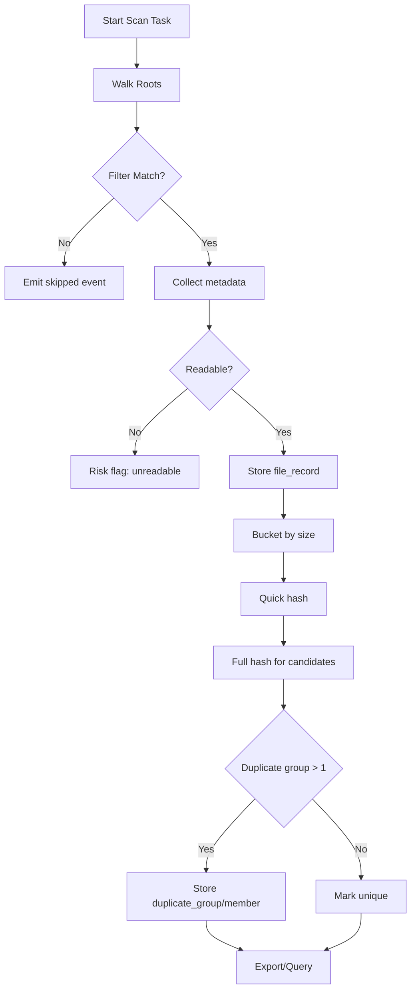

# 扫描与去重流程（阶段 1）

```mermaid
flowchart TD
    A[Start Scan Task] --> B[Walk Roots]
    B --> C{Filter Match?}
    C -- No --> D[Emit skipped event]
    C -- Yes --> E[Collect metadata]
    E --> F{Readable?}
    F -- No --> G[Risk flag: unreadable]
    F -- Yes --> H[Store file_record]
    H --> I[Bucket by size]
    I --> J[Quick hash]
    J --> K[Full hash for candidates]
    K --> L{Duplicate group > 1}
    L -- Yes --> M[Store duplicate_group/member]
    L -- No --> N[Mark unique]
    M --> O[Export/Query]
    N --> O
```
