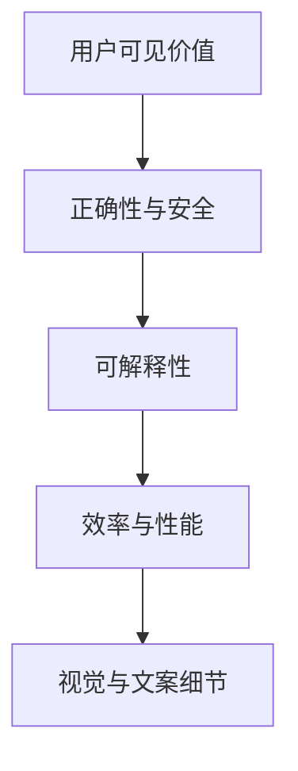

# 规划逻辑与决策链

## 1. 需求演进逻辑

本项目的规划并非一次性静态设计，而是按用户价值逐层推进：

1. 先可用：完成扫描/索引/去重主干。
2. 再可理解：引入智能分析与风险说明。
3. 再可治理：加入保留策略与压缩能力。
4. 再可控：强化选择语义与安全边界。
5. 再可维护：推进本地化集中治理与 PRD 同步。

## 2. 决策优先级

## 3. 关键决策示例

1. 选择语义：压缩目标仅绑定 checkbox 选中项，不绑定详情焦点项。
2. 去重展示：去掉示例噪声，强调文件名、成员数、可释放空间。
3. Hash 展示：默认简洁触发文案，完整值通过悬浮/点击提示层查看。
4. UI 架构：详情与“这是什么”拆为同级模块，支持比例调节（最终 4/6）。
5. i18n 路线：从 TS 内嵌词典迁移为 JSON 资源驱动。
6. 安全加固：敏感接口增加本地来源/客户端/token/路径边界校验。

## 4. 规划方法论

1. 每轮只解决一个明确痛点，避免大规模无验证重写。
2. 每次改动都伴随构建验证（build/build:ui）。
3. UI 文案与行为必须和后端约束一致（尤其是安全与删除语义）。
