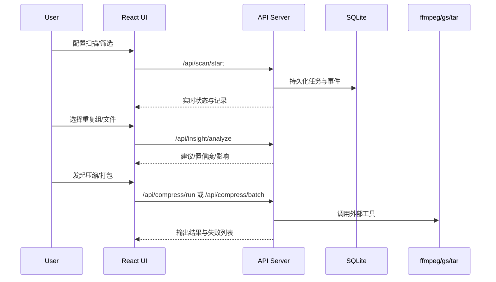

# 执行方案与交付路径

## 1. 端到端执行框架

## 2. 分层方案

1. UI 层：筛选、列表、详情、分析与压缩交互。
2. API 层：扫描任务、分析、压缩、删除/复制、安全校验。
3. 核心层：扫描、去重、风险识别规则。
4. 存储层：SQLite（任务、文件、重复组、风险、缓存）。
5. 外部工具层：ffmpeg/ffprobe、Ghostscript、tar、zip。

## 3. 交付节奏建议

1. 功能迭代：按“扫描主干 -> 分析 -> 压缩 -> 安全 -> i18n”推进。
2. 质量闸门：每轮至少通过 `npm run build` 与 `npm run build:ui`。
3. 文档同步：PRD 与 Wiki 在每次里程碑后更新。

## 4. 验证策略

1. 构建验证：TypeScript 与 Vite 打包。
2. API 验证：关键接口请求/响应与失败路径验证。
3. 交互验证：选择语义、提示层层级、本地化回归。
