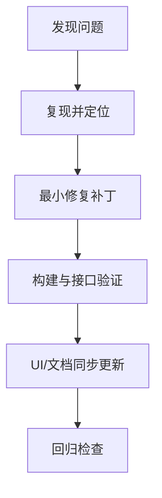

# 问题清单与解决方案（历史沉淀）

## 1. 运行与环境问题

### 1.1 后端进程陈旧导致接口行为异常

- 现象：路由 404、行为与代码不一致。
- 根因：旧进程占用端口或未重启到最新代码。
- 方案：固定在关键改动后重启 API，并使用构建与接口验证确认版本。

### 1.2 类型与工具链兼容问题

- 现象：第三方类型缺失、构建报错。
- 方案：补齐类型依赖（如 `@types/yazl`），并按 TS 报错精准修复。

## 2. 功能与逻辑问题

### 2.1 选择语义混淆（详情焦点误当选中）

- 现象：用户点击某个索引项查看详情，却被计入压缩目标。
- 方案：压缩目标严格绑定 checkbox 选择，不绑定当前详情焦点。

### 2.2 重复组展示信息噪声过高

- 现象：展示了过多示例文件名，信息密度不合理。
- 方案：保留关键指标，标题改为文件名，示例行移除。

### 2.3 Hash 信息可见性与可读性冲突

- 现象：完整 hash 直出影响阅读。
- 方案：改为“ⓘ 哈希值校验完成”触发提示，支持悬浮显示、点击常驻、点外部关闭。

## 3. UI 与交互问题

### 3.1 提示浮层被遮挡

- 现象：提示层被其他区域覆盖。
- 方案：采用 portal + 高 z-index，并固定定位计算。

### 3.2 详情与分析模块层级不清

- 现象：分析模块曾嵌套在详情内部，层级语义不一致。
- 方案：拆成右侧同级模块，并可调配比例（最终 4/6）。

### 3.3 下拉箭头显示与对齐问题

- 现象：箭头偏右、后续样式覆盖导致箭头消失。
- 方案：统一 select 箭头样式并在末尾做覆盖收口，保证所有下拉稳定显示。

## 4. 本地化问题

### 4.1 中文页面残留英文术语

- 现象：例如类型出现 directory 等英文。
- 方案：增加类型映射函数，按语言输出本地化标签。

### 4.2 i18n 数据分散

- 现象：词条与硬编码并存，不利于新增语言和批量翻译。
- 方案：迁移到 JSON 词典驱动，后续继续推进全量抽键。

## 5. 安全问题

### 5.1 敏感接口无强约束

- 风险：本地页面被恶意来源诱导调用删除接口。
- 方案：增加来源/客户端/token 校验、路径边界校验、请求体上限。

## 6. 问题处理流程建议

