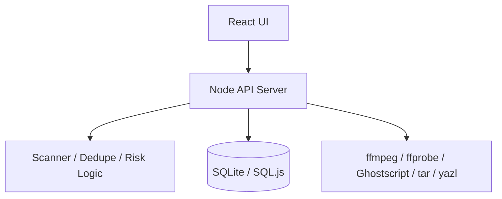

# 架构与 API 总览

## 1. 总体架构

## 2. 主要模块

1. `src/api-server.ts`：路由编排、任务管理、安全校验、压缩调度。
2. `src/storage/sqliteStore.ts`：任务、文件、重复组、风险、缓存持久化。
3. `src/ui/App.tsx`：主界面、筛选与交互、详情与分析模块。
4. `src/ui/i18n.ts` + `src/ui/locales/*`：本地化资源加载。

## 3. 关键 API（概念层）

### 3.1 扫描

1. `POST /api/scan/start`
2. `GET /api/scan/:taskId/status`
3. `GET /api/scan/:taskId/records`
4. `POST /api/scan/:taskId/pause`
5. `POST /api/scan/:taskId/cancel`

### 3.2 任务结果

1. `GET /api/tasks`
2. `GET /api/tasks/:taskId/bundle`
3. `GET /api/tasks/:taskId/duplicate-groups.csv`

### 3.3 智能分析与配置

1. `GET/POST /api/insight/settings`
2. `POST /api/insight/analyze`

### 3.4 压缩与打包

1. `POST /api/compress/run`
2. `POST /api/compress/batch`

### 3.5 保留策略

1. `GET/POST /api/retention/settings`

### 3.6 安全会话与敏感操作

1. `GET /api/session`
2. `POST /api/delete-files`
3. `POST /api/delete-directories`
4. `POST /api/copy-items`

## 4. 安全控制点

1. 敏感接口校验来源、客户端标识与 token。
2. 路径必须位于授权扫描根内。
3. JSON body 限流与无效 JSON 拒绝。

## 5. 数据持久化要点

1. 扫描任务事件与记录可回放。
2. 重复组与风险标记长期可查询。
3. Retention 周期清理历史任务与分析缓存。
