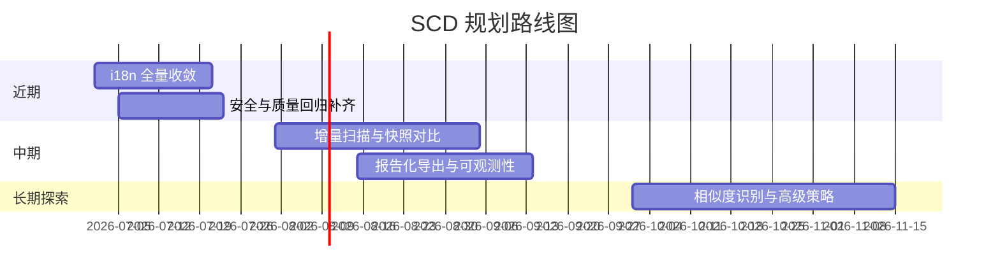

# 后续目标与路线图

## 1. 近期目标（1-2 个迭代）

1. i18n 全量抽键，彻底去硬编码。
2. 安全相关自动化测试补齐。
3. “这是什么”结果结构化增强。
4. 压缩结果页增加失败分类与空间收益说明。

## 2. 中期目标（3-5 个迭代）

1. 增量扫描与差异对比能力。
2. 更丰富的导出模板（报告化）。
3. 任务监控与可观测性提升（错误分布、性能指标）。
4. 设置与术语中心化管理。

## 3. 长期目标（探索）

1. 相似内容识别（图片/媒体）。
2. 可控的批处理执行器（强保护机制下）。
3. 更完善的多语言与内容发布流水线。

## 4. 路线图图示

## 5. 风险提示

1. 外部工具依赖（ffmpeg/gs/tar）存在环境差异风险。
2. 本地文件系统边界复杂，删除相关功能必须持续保守。
3. UI 与文案快速迭代时，i18n 回归风险较高，需工具化约束。
