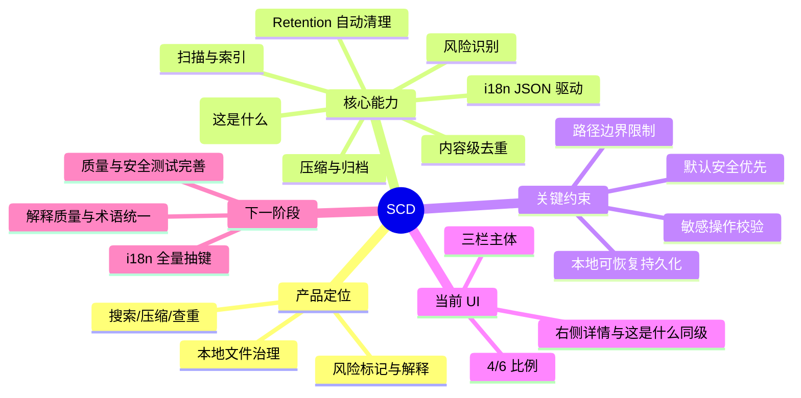
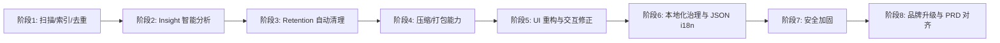

# SCD Wiki（DiskOrg Control Panel）

本目录用于沉淀本项目从需求演进到落地实现的完整过程，适配后续迁移到 Wiki.js。

## 阅读入口

1. [产品总览与范围](01-product-scope.md)
2. [规划逻辑与决策链](02-planning-logic.md)
3. [执行方案与交付路径](03-implementation-plan.md)
4. [功能清单与说明](04-feature-catalog.md)
5. [问题清单与解决方案](05-problem-log-and-solutions.md)
6. [架构与 API 总览](06-architecture-and-api.md)
7. [本地化体系与内容治理](07-localization-and-content.md)
8. [后续目标与路线图](08-roadmap.md)

## 项目代号与命名

- 产品名：DiskOrg Control Panel
- 简称：SCD

## 全局思维导图

## 里程碑概览

